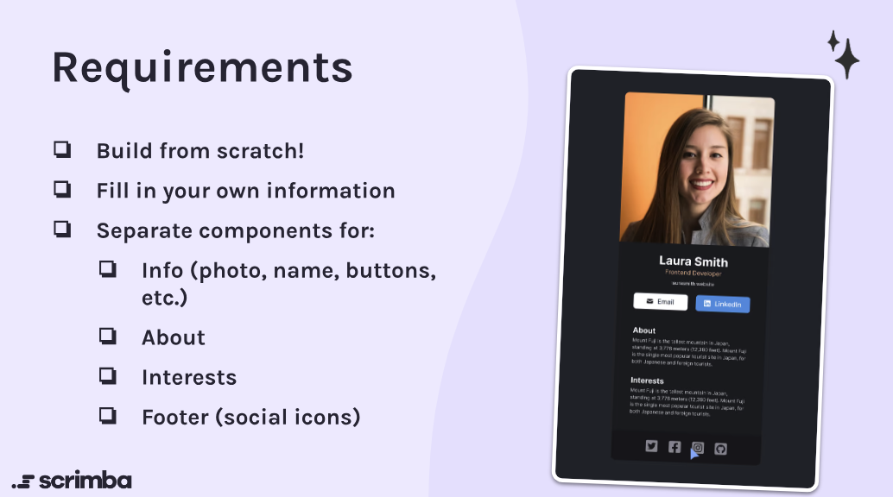

## Digital Business Card

### The challenge:

This is a Scrimba solo project using HTML, CSS, JavaScript and React to create a Digital Business Card.

### The requirements:

### Process

- Consult Figma design files
- Create draft of README file
- Create .gitignore file
- Create Github repository
- Work on HTML, CSS, JS and React files/components
- Check final code and accessibility
- Finalize README file
- Publish live URL
